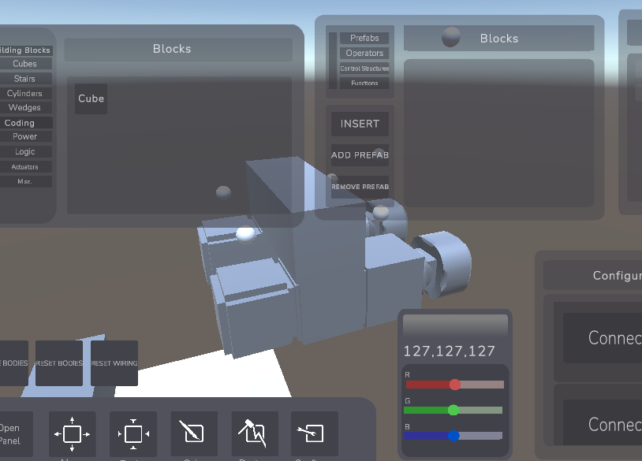

### WHAT IS THIS!!
This sort of just started out as my first practice project in Unity, where you could just place and resize blocks. I worked on it for a while, got some practice, then abandoned it for other things. I worked on it sporadically over the next year or so, but this summer I really decided to pick it up again. I always thought sandbox or machine-building games were the coolest types of games, so I cleaned up my bad code from a year ago and turned this into one.

I'm pretty proud of my code and it took quite a lot of thinking. I had to figure out an algorithm to turn blocks into wiring and then have the wiring work. (recursively checks blocks in front). The system that stored the wiring was very object oriented, with each wire/component being an object. I had to figure out an algorithm to organize clusters of connected blocks into bodies that could be manipulated by motors and thrusters (its just a flood algorithm but shh). As for packages and stuff I used a lot of unity packages since it's a unity game.

### How to use

Head over to https://itch.io/game/edit/3919370!! It is WebGL so you should be able to play it in the browser.

## Buttons

# Movement:
E - up
Q - down

W - forward
A- move left
S - move back
D - move right

arrow keys - turn cam in that direction

# Resize button: 
Toggles resize mode. Click on block to make handles appear

# Move button
Toggles move mode. Click on block to make handles appear

# ADD PREFAB button
Will turn your selected blocks (u can select with shift-click) into a prefab and add it to the prefab list.

# INSERT button
Will insert your prefab into the world and make it your selected block.

# COLOR
Slide the color bars to change the selected color. Select the color button and then click a block to make it appear that color. Blocks placed will also inherit your selected color.

# DESTROY
Click destroy button & then click the block that you hate

# Configure button:
Toggles configure mode. Only works on Buttons for now. Click on button to make Start and Connect button appear. Connect button 
will compile your wiring into an electronic system. Toggle the button and send a signal using your G key.

## Wiring system

The wire system is quite simple for now. Buttons are activated by a key press. Each time you place a button the keybind changes (so for example, your first button placed will have a keybind of i believe Q, and your second button will be W, third will be E etc.)

Wires, logic gates and buttons pass signals toward the direction theyre facing every wire-tick (around half a second). Motors and thrusters will NOT pass energy, and it will deplete over time as they use it up. 

Gates do what they do, so the AND gate will only open up if both of its ports have a signal. You can see the signal as the orb over the electronic block.

In order to make thrusters and motors actually work, click MAKE BODIES. This will organize your blocks into solid bodies that can be moved. To establish connections, click Configure, click a button, then click Connect. Orbs should then appear above connected blocks.

